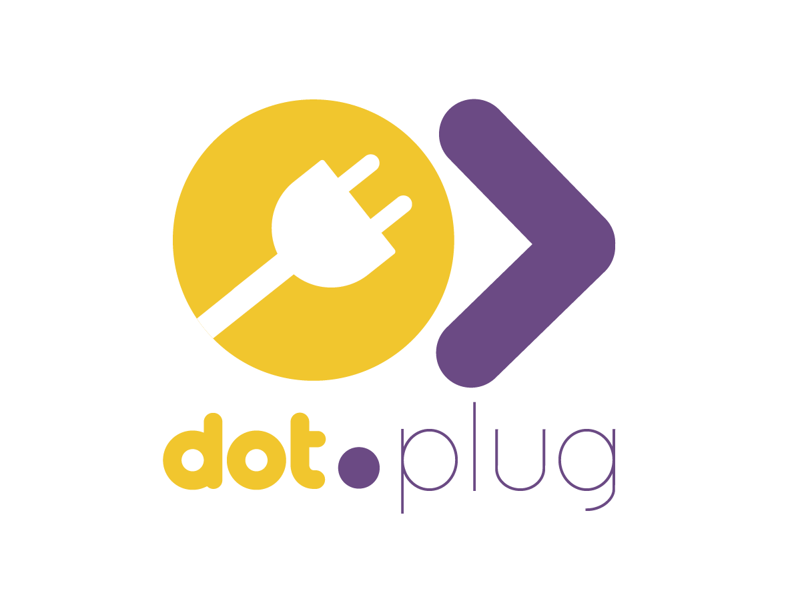

<div align="center">



# Dot.Plug

</div>

Developer marketplace and extension framework for the Dot Ecosystem — third-party developers build, certify, and publish extensions (integrations, connectors, domain add-ons, vertical tools) that add capability to any Dot platform without changing that platform's core codebase.

Full architecture, domain model, and roadmap: [`wiki.md`](./wiki.md).

## Status

**MVP scaffold, hand-authored and UNVERIFIED.** This codebase was written in an environment with no PHP, Composer, or PostgreSQL available. It has never been installed, migrated, or run. Treat it as a careful first draft, not working software, until someone with a real PHP toolchain runs it and fixes what doesn't work.

## Stack

- Laravel 12, PHP 8.3+
- Jetstream (Livewire stack) + Fortify + Sanctum — teams, auth, API tokens
- Tailwind CSS, Vite
- PostgreSQL

## What's implemented

- Jetstream Teams application shell: registration/login, teams, profile, two-factor auth, API tokens, the ecosystem SSO handoff route (`/auth/ecosystem`), an in-app notification bell.
- Marketplace MVP:
  - `Extension`, `ExtensionVersion`, `Installation` models and migrations (team-scoped — a publisher is just a Jetstream `Team`).
  - Browse/publish/view extension listings (`/extensions`).
  - Install/uninstall an extension for the current team.
  - A dashboard showing what the current team has installed and, if it's a developer team, what it has published.
  - A seeder with a handful of example extensions.
- Feature tests covering the copied Jetstream flows plus the new marketplace flows (`tests/Feature/Plug/ExtensionMarketplaceTest.php`, `tests/Feature/DashboardTest.php`).

## What's not implemented

Capability grants, the certification pipeline, the extension runtime/sandbox, anomaly detection, reviews/moderation, payments, version diffing, and Knowledge Pack publishing to Dot.Brain. See `wiki.md` §3–§7 for the full built-vs-planned breakdown.

## Getting started

Not verified to work — there was no PHP/Composer available to test this. In theory, on a machine with PHP 8.3+, Composer, Node, and PostgreSQL:

```bash
composer install
cp .env.example .env
php artisan key:generate
# create the database named in .env (DB_DATABASE), then:
php artisan migrate --seed
npm install
npm run build   # or `npm run dev` for local development
php artisan serve
```

Default seeded login: `test@example.com` (see `database/seeders/DatabaseSeeder.php` — Jetstream's factory sets a password you'll need to check/reset via `password.php` config or `php artisan tinker`).

## Testing

```bash
php artisan test
```

Not run in this environment — see the status note above.
